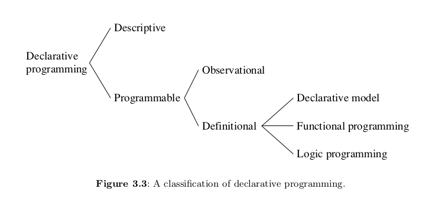

[](https://github.com/FdelMazo/7531-TDL)

# Historia

[Early LISP History (1956 - 1959) ~ Herbert Stoyan](https://campus.hesge.ch/Daehne/2004-2005/Langages/Lisp.htm)

[History of Lisp ~ John McCarthy](http://www-formal.stanford.edu/jmc/history/lisp/lisp.html)

[Revenge of the Nerds ~ Paul Graham](http://www.paulgraham.com/icad.html)

[Lets LISP like it's 1959](https://youtu.be/hGY3uBHVVr4) // [LISP and the foundations of computing](https://lwn.net/Articles/778550/)

##


> "Programming is the problem of describing procedures or algorithms to an electronic calculator."

~ John McCarthy, The Programming Problem

## ¿Por qué nace LISP?

- Un lenguaje de programación para Inteligencia Artificial Simbólica.

  - ¿Cómo se representa el conocimiento humano en términos computacionales?

- McCarthy busca un lenguaje: Explicito, universal, conciso.

- Una respuesta al modelo secuencial (la máquina de Turing) y al paradigma imperativo (FORTRAN).

## ¿Cómo nace LISP?

**Idea**

- En los 50 se empiezan a desarrollar los primeros lenguajes de alto nivel (FLOW-MATIC, FORTRAN)

- En 1956, en una conferencia de AI, McCarthy se inspira para comenzar a diseñar LISP (LISt Proccessing) usando:

  - Las ideas de procesamiento de listas y recursión de IPL-II

  - El alto nivel de FORTRAN (1957) y su expresión algebraica.

  - La notación del cálculo Lambda de Alonzo Church.

## ¿Cómo nace LISP?

**Definición**

- 1958: "An Algebraic Language for the Manipulation of Symbolic Expression"

  - Primer diseño (incompleto) de LISP.

  - Comienzos de la programación funcional.

- 1960: "Recursive Functions of Symbolic Expressionsand Their Computation by Machine, Part I"

  - Especificación completa de LISP, un lenguaje _teórico_, que no estaba pensado para ser implementado.

  - Solución más comprensible a la máquina de Turing.

  - Para demostrar que es Turing-Completo, define una "función universal de LISP", que luego llegaría a ser `eval`.

## ¿Cómo nace LISP?

**Implementación**

- 1960: Steve Russell, un alumno de McCarthy, decide probar e implementar en código máquina `eval`

  - Primer interprete de LISP, para la IBM 704.

- 1962: Tim Hart y Mike Levin hacen el primer compilador de LISP.

  - Lo más cercano al LISP que conocemos hoy en día.

  - Funciones compiladas e interpretadas pueden ser intercambiadas libremente.

# Para qué sirve (y para qué no)

_Se explica en qué casos es bueno y malo el lenguaje con los motivos_

# Caracteristicas del Lenguaje

## Pionero

[What Made Lisp Different ~ Paul Graham](http://www.paulgraham.com/diff.html)

[Influential Programming Languages, Lisp ~ David Chisnall](https://www.informit.com/articles/article.aspx?p=1671639)

- **if-then-else**: Las expresiones condicionales fueron definidas en el paper de 1960, con `cond`. Un condicional es un una construcción if-then-else; hoy en día los damos por hecho. Fueron inventados por McCarthy en el transcurso de desarrollo de Lisp.

- **Funciones**: Las funciones son objectos de primera clase, son un tipo de dato como lo son los enteros, cadenas, etc. Tienen una representación literal, pueden ser asignadas a variables, pasadas como argumentos (parámetros)...

- **Recursión**: Ya existía matemáticamente, pero nunca en un lenguaje de programación

- **Un nuevo concepto en variables**: Todas las variables son efectivamente punteros. Los valores son aquellos que _tienen tipos_, no variables. Asignar variables significa copiar punteros, y no aquello a lo que apuntan.

- **Garbarge Collection**: Con un diseño primitivo (no era concurrente), LISP fue el primer lenguaje en utilizar garbage collection automático.

- **Programas compuestos por expresiones**: Los programas en Lisp son árboles de expresiones, cada uno devuelve un valor. (En otras expresiones de Lisp, puede devolver múltiples valores). Esto es en contraste con los lenguajes más exitosos, que distinguen entre _expresión_ y _declaración_. Cuando un lenguaje está hecho enteramente de expresiones, uno puede componer expresiones como uno quiera:
  Puede ser (en syntaxis de _Arc_):

```lisp
  (if foo (= x 1) (= x 2))
```

o

```lisp
(= x (if foo 1 2))
```

- **Tipado dinámico**: No hay que explicitar si algo es un átomo o una lista.

- **Interactividad**: Gracias al interprete REPL se tiene feedback inmediato y se puede programar desde abajo para arriba, compilando incrementalmente.

- **El lenguaje completo está siempre disponible**: No hay una distinción real entre tiempo de lectura, tiempo de compilación y tiempo de ejecución. Uno puede compilar o ejecutar mientras lee, leer o ejecutar código mientras compila, leer o compilar mientras se ejecuta el código.

- **Map y Reduce**: LISP fue el primer lenguaje en implementar dos funciones muy importantes en la programación funcional.

## Paradigma



~ Peter Van-Roy, Concepts, Techniques, and Models of Computer Programming

- Programación declarativa: definir el _qué_ sin explicar el _cómo_

  - Programación funcional: los componentes se definen como funciones matemáticas

    - Determinístico

    - Misma entrada garantiza misma salida

    - No hay estado

    - No hay efectos secundarios

    - Programación de alto orden:

      - Funciones como ciudadanos de primera clase: se pueden usar en cualquier contexto

      - Funciones de alto orden: poder recibir como parametro o retornar funciones

Lisp es un lenguaje de programacón de tipo multiparadigma, esto quiere decir que soporta más de un paradigma de programación. Lisp es orientado a objetos, reflexivo(capacidad de un programa de observar y modificar su estructura de alto nivel, como Lisp no distingue entre tiempo de ejecución y tiempo de compilación, no va a haber diferencia entre compilación o interpretación de código y reflexión), imperativo(instrucciones en forma de algoritmos) y funcional. Por lo tanto el programador será capaz de crear programas usando más de un estilo de programación, sin estar forzado a tomar un estilo en particular.
Existen otros lenguajes multiparadigma como Python, este además de programación orientada a objetos, programación imperativa y programación funcional, acepta otros paradigmas soportados mediante el uso de extensiones. Oz tambien es un lenguaje de programación multiparadigma que incluye la idea de programación lógica, funcional(tanto lazy como eager), impertativa, orientada a objetos, con restricciones, distribuida y concurrente.

## Compilado/interpretado

Varias implementaciones de dialectos anteriores de Lisp proporcionaron tanto un intérprete como un compilador. En cuanto a Common List no es un compilador en tiempo de ejecución, sino que es necesario invocar al compilador medicante las funciones COMPILE, para las funciones individuales y COMPILE-FILE, para los archivos. Ademas el compilador puede recibir instrucciones sobre qué tan dinámico debe ser el código compilado.
Gracias al interprete REPL(Read-Eval-Print-Loop) se tiene feedback inmediato y se puede programar desde abajo para arriba, compilando incrementalmente. La función _eval_, va a toma las entradas individuales del usuario(s-expression pre parseada), las evalúa y devuelve el resultado al usuario.
No existe una distinción entre el tiempo de compilación, tiempo de ejecución y el tiempo de lectura:

- Ejecutar código en tiempo de lectura permite al usuario reprogramar la sintáxis de Lisp.
- Ejecutar código en tiempo de compilación es la base de las macros.
- Compilar en tiempo de ejecución es la base del uso de Lisp como un lenguaje de extensión en programas como lo es Emacs.
- Leer en tiempo de ejecución permite a los programas comunicarse utilizando _s-expressions_, una idea recientemente reinventada como _XML_.

[How is Lisp dynamic and compiled? - StackOverflow](https://stackoverflow.com/questions/12593768/how-is-lisp-dynamic-and-compiled/12595700#12595700)

(Interpretado || Compilado) -> True

<< es interactivo o interpretado???>>

<<<ver ansi common lisp 6.6 closures / 6.7 dynamic scope / 6.8 compilation / 6.9 recursion >>>

## Tipado

Lisp es un lenguaje de tipado dinámico porque las verificaciones de tipo se realizan en tiempo de ejecución y las variables se pueden configurar de forma predeterminada para todo tipo de objetos.

_Dato_: Ademas de ser de tipado dinámico, Lisp es dinámico, porque tanto el lenguaje de programación Lisp como el programa en sí se pueden cambiar en tiempo de ejecución: se le prermite al usuario agregar, cambiar y eliminar funciones, construcciones sintácticas, tipos de datos, se podrá cambiar la sintaxis de superficie de Lisp de varias maneras. Esto facilite a que Lisp se tipee dinámicamente para proporcionar algunas de estas características.

- Explota en runtime

  - Tipado fuerte: explota

  - Tipado dinamico: en runtime

## Lexical/Static Scoping

## Metaprogramming / Extensibilidad / Macros

https://sep.yimg.com/ty/cdn/paulgraham/onlisp.pdf?t=1564708198&

cahpter 4 de practical common lisp

Further, because Lisp code has the same structure as lists, macros can be built with any of the list-processing functions in the language. In short, anything that Lisp can do to a data structure, Lisp macros can do to code. In contrast, in most other languages, the parser's output is purely internal to the language implementation and cannot be manipulated by the programmer.

https://youtu.be/dw-y3vNDRWk

The Lisp feature that makes this trivially easy is its macro system. I can't emphasize enough that the Common Lisp macro shares essentially nothing but the name with the text-based macros found in C and C++.

## Expression oriented / Simbolico

Usa S-Expressions: Simbolic expression

Lisp is an expression oriented language. Unlike most other languages, no distinction is made between "expressions" and "statements";[dubious – discuss] all code and data are written as expressions. When an expression is evaluated, it produces a value (in Common Lisp, possibly multiple values), which can then be embedded into other expressions. Each value can be any data type.

https://en.wikipedia.org/wiki/Expression-oriented_programming_language

## Homoiconicidad ("Code as Data")

- Gracias a las S-Expressions

- Codigo y estructuras de datos intercambiable

- La representación interna del programa es la que se lee

- Todo es una lista -> Code and Data are made out of the same data structures, and the quote operator is the way we distinguish between them

- Reflexion mucho mas sencilla

- Lisp functions can be manipulated, altered or even created within a Lisp program without lower-level manipulations

- Extensibilidad mucho mas facil

- List of lists ??? Tree!

- And how do we deal with trees? Recursion!

- El abstract syntax tree de una funcion se puede manipualr como una estructura de datos y luego evaluar

- s-expressions can represent arbitrary tree expressions, much like the usual abstract syntax tree

- anything that Lisp can do to a data structure, Lisp macros can do to code

This feature makes it easy to develop efficient languages within languages. For example, the Common Lisp Object System can be implemented cleanly as a language extension using macros. This means that if an application needs a different inheritance mechanism, it can use a different object system. This is in stark contrast to most other languages; for example, Java does not support multiple inheritance and there is no reasonable way to add it.

## s-exprs as trees

- Las s-expresiones son binary trees porque son o atomos o (x y) siendo (x . y) un dotted pair (x hijo izq, y hijo der)

- (hoy por hoy se usa el sintacic sugar LIST, que es nada mas concatenar mil dotted pairs. (x y z) es (x . (y . (z . null))))

- foto binary tree

## Manejo de memoria

ver ansi common lisp 3.3 y 3.16

## Control de flujo

Common Lisp proporciona una variedad de estructuras especiales para organizar programas. Las mismas se implementan como formas especiales o como macros. En general, los programas Lisp se escriben como una gran colección de pequeñas funciones, cada una de las cuales implementa una operación simple. Estas funciones funcionan llamándose entre sí, por lo que las operaciones más grandes se definen en términos de las más pequeñas. Las funciones de Lisp pueden recurrir a sí mismas de forma recursiva, ya sea directa o indirectamente.

Las funciones definidas localmente (flet, etiquetas) y macros (macrolet) son bastante versátiles. La nueva función de macro de símbolos permite una flexibilidad aún más sintáctica.

Si bien el lenguaje Lisp tiene un estilo más aplicativo que orientado a declaraciones, proporciona muchas operaciones que producen efectos secundarios y, en consecuencia, requiere construcciones para controlar la secuencia de los efectos secundarios. `progn`, es más o menos equivalente a un bloque de inicio-fin con todos sus puntos y comas, ejecuta varias formas secuencialmente, descartando los valores de todos menos el último. Muchas construcciones de control de Lisp incluyen secuenciación implícita, en cuyo caso se dice que proporcionan un `implicit progn`.

Para los ciclos, Common Lisp proporciona la facilidad de iteración general y nos facilita la iteración y mapeo especificamente sobre varias estructuras de datos.

Common Lisp proporciona los condicionales unidireccionales simples `when` y `unless`, el condicional bidireccional simple `if`, y los condicionales multidireccionales más generales como `cond` y `case`.

Se proporcionan construcciones para realizar salidas no locales con diversas disciplinas de alcance: `block`, `return`, `return-from`, `catch`, y `throw`.

[Common Lisp the Language - Control Structure](https://www.cs.cmu.edu/Groups/AI/html/cltl/clm/node76.html)
[Data and Control Flow (ejemplos de funciones y macros)](https://mr.gy/ansi-common-lisp/Data-and-Control-Flow.html#Data-and-Control-Flow)

## TDA

## Parámetros

## Transparencia referencial: equals can be replaced by equals

## Manejo de memoria

## Recursividad

> Recursive computations are at the heart of declarative programming.

~ Peter Van-Roy, Concepts, Techniques, and Models of Computer Programming

## Manejo de concurrencia

## Cálculo Lambda

https://youtu.be/eis11j_iGMs

?x. x?x.

(lambda (x) (x\*x))

The power of the lambda notation is in its generality. The lambda notation will handle the case in which the value of a function is a function. In many computer languages the value of a function must be an element of a set, such as a number or a string or the label of a function. In the lambda notation the value can be a function, not the name or label of a function but a function itself.

https://www.sjsu.edu/faculty/watkins/lambda.htm

- Calculo Lambda no tipado: expresa _mas_ que el calculo lambda tipado

## Evaluacion

- Eager / Data-driven evaluation

- Todo se evalua

Lisp is usually evaluated eagerly. In Common Lisp, arguments are evaluated in applicative order ('leftmost innermost').

## Manejo de errores

[Common Lisp the Language - Errors](https://www.cs.cmu.edu/Groups/AI/html/cltl/clm/node219.html#SECTION002800000000000000000)

## Paralelismo

## Code vs Data

[Code vs Data (Metaprogramming) ~ Computerphile](https://youtu.be/dw-y3vNDRWk)

# Sintaxis

[LISP 1.5 Programmer's Manual](http://web.cse.ohio-state.edu/~rountev.1/6341/pdf/Manual.pdf)

[Common Lisp HyperSpec](http://clhs.lisp.se/Front/index.htm)

[Learn X in Y minutes, Where X=Common Lisp](https://learnxinyminutes.com/docs/common-lisp/)

## Expresiones -> átomos y listas

```lisp
;; Todo en LISP se compone de symbolic expressions
1 ; Una s-expression puede ser un átomo -> irreducible
(+ 1 2) ; Una s-expression puede ser una lista -> partible

;; Las s-expressions evaluan a valores
2 ; evalua a 2
(+ 2 3) ; evalua a 5
(+ (+ 2 3) 2) ; (+ 2 3) evalua a 5 -> todo evalua a 7

;; Acá comienza la dualidad entre código (la lista) y data (el átomo)
;; Ambos son S-expressions
```

## Code & Data -> `eval`, `quote`

```lisp
;; El operador quote toma una s-expression y devuelve el código
(+ 1 1) ; evalua a 2
(quote (+ 1 1)) ; evalua a (+ 1 1)
('(+ 1 1)) ; quote se abrevia a '

;; El operador eval toma una s-expresion y devuelve su valor
(eval (+ 1 1)) ; evalua a 2
(eval '(+ 1 1)) ; evalua a 2
(eval ''(+ 1 1)) ; evalua a (+ 1 1)

;; 1 + 1 es 2
;; "1 + 1" es el código 1 + 1
```

Puedo hacer un programa entero, ponerle un `'` adelante, y estoy tratando con el **código** de mi programa.

## Chequeando Valores -> `atom`, `listp`

¿Es código o data?

```lisp
;; atom devuelve si algo es un átomo o no
(atom 1) ; True (el valor de la expresion 1 es un átomo)
(atom (+ 1 2)) ; True (el valor de la expresion (+ 1 2) es un átomo)
(atom '(+ 1 2)) ; Nil (la expresion (+ 1 2) es una lista)

;; listp devuelve si algo es una lista o no
(listp 1) ; Nil (1 no es una lista)
(listp (+ 1 2)) ; Nil (la expresion evalua a 3, no es una lista)
(listp '(+ 1 2)) ; True (estoy hablando del código de la expresion, la lista)
```

## Procesar listas -> `car`, `cdr`, `cons` y `list`

- Las listas en LISP son listas enlazadas

- Los "nodos" (dato y prox) se llaman **cons cells**

  - El dato actual es el **car**

  - El resto es otra lista, el **cdr**

```lisp
;; car recibe una lista y devuelve su primer elemento
(car (+ 1 2)) ; explota, no recibio una lista
(car '(+ 1 2)) ; devuelve +

;; cdr recibe una lista y devuelve el resto (todo menos el primer elemento)
(cdr '(+ 1 2)) ; devuelve (1 2)

;; cons crea un cons de un valor seguido de una lista
;; AKA agrega un valor al principio de la lista
(cons '1 '(2 3)) ; devuelve (1 2 3)
(cons '+ '(2 3)) ; devuelve (+ 2 3)

;; list compone una lista de sus argumentos
(list 1 2 3) ; devuelve (1 2 3)
(list '+ 2 3) ; devuelve (+ 2 3)
;; si tan solo hubiese una manera de ejecutar esta expresion!
```

## Procesar una s-expression -> Programming Bottom Up

```lisp
;; Partimos de la expresion (+ 1 2)
(+ 1 2)
;; La convertimos en el código de la expresion
'(+ 1 2)
;; Sacamos su operador -> el +
(car '(+ 1 2))
;; Sacamos los operandos -> el (1 2)
(cdr '(+ 1 2))
;; Empaquetamos esto nuevamente -> (+ 1 2)
(cons (car '(+ 1 2)) (cdr '(+ 1 2)))
;; Evaluamos la expresion
(eval (cons (car '(+ 1 2)) (cdr '(+ 1 2))))
```

## Namespaces

- Un simbolo puede referirse a:

  - Una variable
  - Una clase
  - Una función
  - Un operador especial
  - Un macro

- Hay dos namespaces en LISP:

  - Function namespace: funciones, operadores especiales, macros

  - Variable namespace: variables, clases

- Lisp-1 (scheme) vs. Lisp-2 (clisp) debate

```lisp
;; Defino una variable y una función con el mismo nombre
(setq X 1)
(defun X (arg) (+ 10 arg))

; Un simbolo por defecto evalua al variable namespace
X ; => 3
; Para referirme explicitamente al function namespace, llamo a `(function symbol)`
(function X) ; => #<FUNCTION X>
; #' es syntactic sugar de function
(#'X) ; => #<FUNCTION X>

; Hay que tener cuidado con lo que quiero
(funcall X 3) ; Explota. Estoy llamando a la variable X
(funcall #'X 3) ; => 13
```

https://wiki.c2.com/?SingleNamespaceLisp

## Sistemas

https://stevelosh.com/blog/2018/08/a-road-to-common-lisp/#s30-modern-common-lisp

# Desglosando `eval`

[The Roots of LISP ~ Paul Graham](http://www.paulgraham.com/rootsoflisp.html)

[The Most Beautiful Program Ever Written ~ William Byrd](https://youtu.be/OyfBQmvr2Hc)

- La magía de LISP es el **read–eval–print loop**: un entorno donde se toma lo escrito por el programador, se lee, se evalua, se imprime, y luego se vuelve a pedir input

- Este self-interpreter es un **evaluador meta-circular**, esta escrito en LISP y puede evaluar código de LISP.

- ¿Cómo? Gracias a la función `eval`, definida por McCarthy en base a 7 operadores que toma como axiomas: `quote`, `atom`, `eq`, `car`, `cdr`, `cons` y `cond`

##

> That was the big revelation to me when I was in graduate school—when I finally understood that the half page of code on the bottom of page 13 of the Lisp 1.5 manual was Lisp in itself. These were "Maxwell's Equations of Software!" This is the whole world of programming in a few lines that I can put my hand over.

~ Alan Kay, [A Conversation with Alan Kay](https://queue.acm.org/detail.cfm?id=1039523)


##

```lisp
;; Anotaciones sobre el código de Paul Graham en Roots of Lisp
; The Lisp defined in McCarthy's 1960 paper, translated into Common Lisp.

; eval recibe una expresion `e` y una lista de argumentos `a` -> El "entorno"
; Básicamente, recibe todo el scope donde estoy parado
(defun eval (e a)
  ; Es todo un if grande de 4 condiciones que chequean el tipo de la expresion
  (cond
    ; Si es un atomo -> Devuelvo su valor en el entorno
    ((atom e) (assoc e a))
    ; Si no es un atomo tiene que ser una lista
    ; Si es una lista del tipo (atomo...resto) -> Es una función!
    ; (car e) es el operador
    ; (cadr e) es (car (cdr e)) que es el primero de los argumentos
    ((atom (car e))
     ; Si Es una funcion, ¿que funcion es?
     (cond
       ; Si es quote, solo devuelvo los argumentos de la funcion
       ((eq (car e) 'quote) (cadr e))
       ; Para el resto de los axiomas, llamo a esa funcion contra los argumentos
       ; Como quiero llamar a la operacion contra los valores de los argumentos, llamo a eval
       ((eq (car e) 'atom)  (atom   (eval (cadr e) a)))
       ((eq (car e) 'eq)    (eq     (eval (cadr e) a)
                                    (eval (caddr e) a)))
       ((eq (car e) 'car)   (car    (eval (cadr e) a)))
       ((eq (car e) 'cdr)   (cdr    (eval (cadr e) a)))
       ((eq (car e) 'cons)  (cons   (eval (cadr e) a)
                                    (eval (caddr e) a)))
       ; cond tiene que evaluar recursivamente todas las condiciones, hasta encontrar el primer true
       ; para eso, se define una funcion auxiliar, `evcon` que recorre la lista de parametros y los evalua
       ((eq (car e) 'cond)  (evcon (cdr e) a))
       ; el caso final es recibir una funcion definida por el usuario
       ('t (eval (cons (assoc (car e) a)
                        (cdr e))
                  a))))
    ; Si no es un atomo ni una lista que comienza por un atomo, entonces es una lista que comienza por otra cosa
    ; Si es una lista que comienza con label, evaluo la funcion a la que refiere
    ((eq (caar e) 'label)
     (eval (cons (caddar e) (cdr e))
            (cons (list (cadar e) (car e)) a)))
    ; Si es una lista que comienza con lambda, evaluo sus parametros
    ((eq (caar e) 'lambda)
     (eval (caddar e)
            (append (pair (cadar e) (evlis  (cdr e) a))
                     a)))))
```

# Estadísticas

_Se incluyen estadísticas de uso del lenguaje, frameworks y la evolución en los últimos años. Para lenguajes antiguos se incluye información sobre qué lenguajes o técnicas se vieron influenciadas por este lenguaje_

http://blockml.awwapps.com/example/example/document.html#sec-6

# Comparaciones

_Se destacan las diferencias del lenguaje contra otros con propósito similar, se incluyen además benchmarks o ejemplos que identifiquen diferencias._

https://wiki.c2.com/?LispSchemeDifferences

http://www.norvig.com/python-lisp.html

https://hyperpolyglot.org/lisp

## Scheme

Los dos dialectos principales a elegir son Common Lisp y Scheme, ambos tienen ventajas y desventajas, pero las diferencias entre ellos sigue siendo chica que comparando contra otros lenguajes, así que no importa cual elejas para empezar. ¿Cuál debería aprender, Common Lisp o Scheme? Cuál es la diferencia?

- Common Lisp: Es poderoso pero feo
- Scheme: Es chiquito y limpio, pero el estándar solamente define es inner core del lenguaje.
- Si tuviera que crear una aplicación, probablemente es mejor ir por Common Lisp.
- Si tuviera que enseniar (no tengo enie) en un curso, usaria Scheme (pero con macros de Common Lisp)

# Casos de estudio

_Se mencionan casos reales indicando el motivo por el cual se sabe o se cree que se usa el lenguaje_

https://github.com/CodyReichert/awesome-cl
