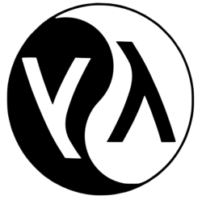

# Historia

[Early LISP History (1956 - 1959) ~ Herbert Stoyan](https://campus.hesge.ch/Daehne/2004-2005/Langages/Lisp.htm)

[History of Lisp ~ John McCarthy](http://www-formal.stanford.edu/jmc/history/lisp/lisp.html)

[Revenge of the Nerds ~ Paul Graham](http://www.paulgraham.com/icad.html)

[Lets LISP like it's 1959](https://youtu.be/hGY3uBHVVr4) // [LISP and the foundations of computing](https://lwn.net/Articles/778550/)

##

> "Programming is the problem of describing procedures or algorithms to an electronic calculator."

~ John McCarthy, The Programming Problem

## ¿Por qué nace LISP?

- Un lenguaje de programación para Inteligencia Artificial Simbólica.

  - ¿Cómo se representa el conocimiento humano en términos computacionales?

- McCarthy busca un lenguaje: Explicito, universal, conciso.

- Una respuesta al modelo secuencial (la máquina de Turing) y al paradigma imperativo (FORTRAN).

## ¿Cómo nace LISP?

**Idea**

- En los 50 se empiezan a desarrollar los primeros lenguajes de alto nivel (FLOW-MATIC, FORTRAN)

- En 1956, en una conferencia de AI, McCarthy se inspira para comenzar a diseñar LISP (LISt Proccessing) usando:

  - Las ideas de procesamiento de listas y recursión de IPL-II

  - El alto nivel de FORTRAN (1957) y su expresión algebraica.

  - La notación del cálculo Lambda de Alonzo Church.

## ¿Cómo nace LISP?

**Definición**

- 1958: "An Algebraic Language for the Manipulation of Symbolic Expression"

  - Primer diseño (incompleto) de LISP.

  - Comienzos de la programación funcional.

- 1960: "Recursive Functions of Symbolic Expressionsand Their Computation by Machine, Part I"

  - Especificación completa de LISP, un lenguaje _teórico_, que no estaba pensado para ser implementado.

  - Solución más comprensible a la máquina de Turing.

  - Para demostrar que es Turing-Completo, define una "función universal de LISP", que luego llegaría a ser `eval`.

## ¿Cómo nace LISP?

**Implementación**

- 1960: Steve Russell, un alumno de McCarthy, decide probar e implementar en código máquina `eval`

  - Primer interprete de LISP, para la IBM 704.

- 1962: Tim Hart y Mike Levin hacen el primer compilador de LISP.

  - Lo más cercano al LISP que conocemos hoy en día.

  - Funciones compiladas e interpretadas pueden ser intercambiadas libremente.
